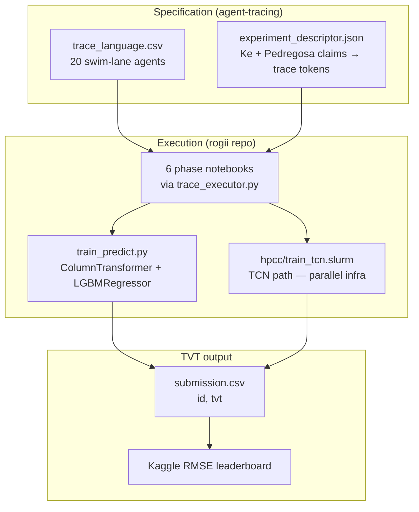
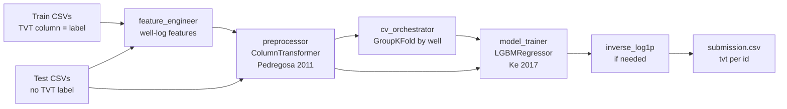

# baseline_column_transformer — TVT pipeline (Ke 2017 + Pedregosa 2011)

**Branch:** `trace/baseline-column-transformer`  
**Approach:** ColumnTransformer + LightGBM baseline  
**Competition:** [rogii-wellbore-geology-prediction](https://www.kaggle.com/competitions/rogii-wellbore-geology-prediction)

This variant predicts **True Vertical Thickness (TVT)** — the competition target column `tvt` in `sample_submission.csv` — using two base papers from [`papers/manifest.json`](../../../papers/manifest.json):

| Paper | Role | `paper_id` |
|-------|------|------------|
| **LightGBM: A Highly Efficient Gradient Boosting Decision Tree** (Ke et al., 2017) | Regression model (histogram GBDT, RMSE objective) | `ke2017_lightgbm` |
| **Scikit-learn: Machine Learning in Python** (Pedregosa et al., 2011) | Heterogeneous preprocessing (`ColumnTransformer` + `Pipeline`) | `pedregosa2011_sklearn` |

Human citations and claim→ablation mapping: [`paper_refs.md`](paper_refs.md). Machine-readable join: [`experiment_descriptor.json`](experiment_descriptor.json).

## Architecture: three layers



- **Specification:** [`trace_language.csv`](trace_language.csv) — each **column** is an agent (swim lane); each **row** is a step.
- **Phase mapping:** `rogii/pipeline/trace_executor.py` → `LANE_TO_PHASE` (six phases in [`mle_plan.json`](mle_plan.json)).
- **Runnable ML:** `/lustre/work/sweeden/rogii/train_predict.py` — canonical Ke + Pedregosa TVT implementation.

**TVT contract:** train on labeled `TVT` (or `tvt` per `sample_submission.csv`); emit one `tvt` prediction per test `id`.

Training data: per-well horizontal-well CSVs with `MD`, log features, `TVT`, `GR`, `TVT_input`; typewell CSVs with `TVT`, `GR`. Test wells omit `TVT` labels.

## Six pipeline phases

| Phase | Notebook | Primary agents |
|-------|----------|----------------|
| `01_data_analysis` | `notebooks/01_data_analysis.ipynb` | `data_downloader`, `schema-sentinel`, `eda_profiler`, `well_group_detector`, `target_diagnostician` |
| `02_statistical_framework` | `notebooks/02_statistical_framework.ipynb` | `experiment-design-architect`, `architecture-decision-recorder`, `dependency-graph-orchestrator`, `seed-control-officer` |
| `03_feature_engineering` | `notebooks/03_feature_engineering.ipynb` | `feature_engineer`, `preprocessor`, `cv_orchestrator` |
| `04_model_training` | `notebooks/04_model_training.ipynb` | `model_trainer`, `model_ensembler`, `predictor` |
| `05_evaluation` | `notebooks/05_evaluation.ipynb` | `oof_evaluator`, `error_analyzer` |
| `06_submission` | `notebooks/06_submission.ipynb` | `submission_formatter`, `submission_validator`, `kaggle_submitter` |

Notebooks call `run_notebook_phase()` from `rogii/pipeline/trace_executor.py`. GPU training and `sbatch` steps are **skipped on the login node**; run on Matador per Slurm rules.

---

## Phase 01 — Data analysis

**Goal:** Load Rogii data and establish TVT as the regression target.

| Agent | Key steps | Paper link | TVT role |
|-------|-----------|------------|----------|
| `data_downloader` | Kaggle download/unzip; list CSVs | — | Fetches per-well CSVs and `sample_submission.csv` (`id`, `tvt`) |
| `schema-sentinel` | `register_schema`, `infer_id_column`, `infer_target_columns` | Pedregosa §2 unified API | Locks submission schema: col 0 = `id`, col 1 = **`tvt`** |
| `eda_profiler` | `load_train_csv`, stats, `plot_target_distribution` | Ke §4 dense numeric features | Profiles **TVT** distribution/skew (drives log1p ablation) |
| `well_group_detector` | `scan_for_well_columns`, `recommend_group_key`, `provide_groups` | Pedregosa Pipeline leak-safe CV | Derives well groups from `id` prefix for GroupKFold |
| `target_diagnostician` | `compute_skewness`, `check_strict_positivity`, `recommend_log1p` | Ke + ablation `target_log1p` | Decides whether to fit `log1p(TVT)` and invert at predict time |

**Code:** `SchemaSentinel` in `rogii/pipeline/agents.py`; target alignment and log1p in `rogii/train_predict.py` (`align_train_target_to_schema`, `recommend_log1p`).

---

## Phase 02 — Statistical framework

**Goal:** Bind the two papers to the experiment design before modeling.

| Agent | Key steps | Paper link |
|-------|-----------|------------|
| `experiment-design-architect` | `load_experiment_descriptor`, `cite_base_paper_ablations`, `design_ablation_factorial_grid`, `plan_episodic_training_schedule` | Maps Ke/Pedregosa **claims → trace tokens** |
| `architecture-decision-recorder` | `record_ablation_plan`, ADRs | Documents ColumnTransformer + LightGBM choice |
| `dependency-graph-orchestrator` | `add_task`, `topological_order`, `bind_producers_to_type3_consumers` | Orders phases so preprocessing precedes training |
| `seed-control-officer` | `pin_seed` | Reproducibility for multi-seed LGBM (42, 69, 2024) |

**Paper-driven ablations** ([`ablation_plan.json`](ablation_plan.json)):

| Factor | Levels | Paper |
|--------|--------|-------|
| `target_log1p` | none / log1p | Ke tabular regression + skewed TVT |
| `numeric_scaler` | standard / robust | Pedregosa preprocessor choice |
| `rolling_window` | 32 / 64 / 128 | Ke heterogeneous numeric feature windows |

**Hypothesis** ([`experiment_descriptor.json`](experiment_descriptor.json)): ColumnTransformer + LightGBM improves **RMSE on post-PS TVT** under nested GroupKFold.

Statistical framework summary: [`statistical_framework.md`](statistical_framework.md).

---

## Phase 03 — Feature engineering & CV

**Goal:** Build Pedregosa-style heterogeneous preprocessing and leak-safe splits. **Pedregosa 2011** is most explicit here.

| Agent | Trace tokens | Pedregosa concept | TVT implementation |
|-------|--------------|-------------------|-------------------|
| `feature_engineer` | `identify_depth_column`, `compute_rolling_features`, `compute_lag_features`, `compute_well_normalization` | Feature blocks for heterogeneous columns | MD-sorted well-log features as LGBM inputs (not the target) |
| `preprocessor` | `build_numeric_pipeline`, `build_lowcard_pipeline`, `build_highcard_pipeline`, `assemble_column_transformer` | ColumnTransformer + Pipeline compose | `train_predict.py` → `build_feature_matrix()` |
| `cv_orchestrator` | `choose_cv_scheme`, `instantiate_groupkfold`, `emit_fold_indices`, nested subdivisions | Leak-safe CV | `GroupKFold` by well; train/val wells disjoint |

**Pedregosa implementation** (`rogii/train_predict.py`):

- **Numeric block:** median imputation (`SimpleImputer`).
- **Low-cardinality categoricals:** most-frequent imputation + `OneHotEncoder`.
- **High-cardinality categoricals:** most-frequent imputation + `OrdinalEncoder`.
- Fused by `ColumnTransformer(remainder="drop")`.

Per fold: `preprocessor.fit(X_train_fold)` → `transform` → matrix fed to LightGBM. Target **TVT** stays outside the ColumnTransformer.

---

## Phase 04 — Model training

**Goal:** Fit Ke 2017 histogram GBDT regressors to predict TVT (optionally in log1p space).

| Agent | Trace tokens | Ke 2017 concept | TVT implementation |
|-------|--------------|-----------------|-------------------|
| `model_trainer` | `set_objective_regression`, `set_metric_rmse`, `log_best_iteration`, `sbatch … train_tcn.slurm` | Histogram GBDT, regression, RMSE, early stopping | `LGBMRegressor` in `train_predict.py` |
| `model_ensembler` | `train_with_seed_42/69/2024`, `average_seed_predictions` | Multi-seed stability | Seed ensemble over fold predictions |
| `predictor` | `collect_oof_predictions`, `load_fold_models`, `predict_per_fold`, `average_test_predictions`, `inverse_log1p` | OOF + test ensemble | Back-transform to **TVT scale** if log1p was used |

**Ke implementation** (`rogii/train_predict.py`):

```python
lgb.LGBMRegressor(
    objective="regression",
    metric="rmse",
    n_estimators=2000,
    learning_rate=0.05,
    num_leaves=63,
    subsample=0.85,
    colsample_bytree=0.85,
    reg_lambda=1.0,
    random_state=42,
)
```

Per-fold training uses `early_stopping(50)` on a validation fold. OOF and test predictions are averaged across folds (and optionally across seeds).

**TCN coexistence:** The trace also lists `train_tcn_episodic.slurm` / `train_tcn.slurm` (Temporal CNN on MD sequences). That path predicts TVT but is **not** the Ke/Pedregosa method — shared competition infrastructure. The paper-faithful path is `train_predict.py`. Trace row 134 installs LightGBM before the LGBM training tokens.

---

## Phase 05 — Evaluation

**Goal:** Score TVT predictions with competition RMSE (Ke's chosen metric).

| Agent | Steps | Ke link |
|-------|-------|---------|
| `oof_evaluator` | `compute_rmse_per_fold`, `compute_mean_oof_rmse`, `report_std_across_folds` | RMSE objective/metric |
| `error_analyzer` | `compute_residuals`, `slice_by_well`, `slice_by_depth_bin`, `identify_worst_wells` | Diagnose where GBDT misses TVT along borehole |

**SMRE:** mean RMSE ± std across folds. OOF RMSE is on **original TVT scale** (after `expm1` when log1p training is active).

Paper compliance audit: [`reviews/paper_compliance_latest.json`](reviews/paper_compliance_latest.json).

---

## Phase 06 — Submission

**Goal:** Emit Kaggle-valid `id,tvt` CSV.

| Agent | Steps | TVT role |
|-------|-------|----------|
| `submission_formatter` | `align_to_sample_submission_columns`, `set_id_column`, `set_prediction_columns` | Maps test rows → **`tvt`** column |
| `submission_validator` | `assert_row_count_matches_test`, `assert_no_nans`, `assert_columns_match_sample` | Type-3 gate on submission envelope |
| `kaggle_submitter` | `kaggle competitions submit … submission.csv` | Uploads TVT predictions for RMSE scoring |

Final step in `train_predict.py`: fold-averaged test predictions → optional `expm1` → `DataFrame({id_col, target})` → `submission.csv`.

---

## End-to-end TVT data flow



---

## Trace tokens ↔ papers

| Paper | Trace tokens | Phase / agent |
|-------|--------------|---------------|
| **Pedregosa 2011** | `build_numeric_pipeline`, `build_lowcard_pipeline`, `build_highcard_pipeline`, `assemble_column_transformer` | Phase 03 / `preprocessor` |
| **Ke 2017** | `set_objective_regression`, `set_metric_rmse`, `log_best_iteration`, `train_with_seed_42` | Phase 04 / `model_trainer`, `model_ensembler` |

Trace-theory paper (agent audit layer, not in `manifest.json`): *Agentic Programming as Formal Automata* (`agent-tracing`) — governs `trace_language.csv` execution, not the ML method.

---

## Running the pipeline

**Phase notebooks (artifact handoffs):** [`notebooks/README.md`](notebooks/README.md) — run `01` … `06` in order; outputs under [`artifacts/`](artifacts/).

```bash
cd traces/preprocessing/baseline_column_transformer/notebooks
python -c "from phase_runner import run_01_data_analysis; run_01_data_analysis()"
# … run_02 … run_06 in order
```

Regenerate notebooks: `python notebooks/write_phase_notebooks.py`

**Validate trace (login node):**

```bash
cd /lustre/work/sweeden/frontier-evals/project/paperbench
uv run python -m paperbench.scripts.implement_agent_tracing --validate-traces
uv run python -m paperbench.trace_pipeline.orchestrator --variant baseline_column_transformer --dry-run
```

**Canonical Ke + Pedregosa TVT baseline (rogii repo):**

```bash
cd /lustre/work/sweeden/rogii
mamba activate kc-rogii-wellbore-geology-prediction
python train_predict.py --data-dir data --out submission.csv
```

**Phase notebooks (trace executor, sbatch skipped):**

```bash
# From rogii conda env; run notebooks under notebooks/01 … 06
jupyter lab traces/preprocessing/baseline_column_transformer/notebooks/
```

**Full Slurm pipeline:** submit variant jobs from `/lustre/work/sweeden/rogii/hpcc/` — one active job per branch; see workspace Slurm rules.

**Interactive preflight (before `sbatch`):** [`SLURM_INTERACTIVE_PREFLIGHT.md`](SLURM_INTERACTIVE_PREFLIGHT.md) — match `train_tcn_episodic.slurm` resources via `/etc/slurm/scripts/interactive`; stop at `# LONG_RUNNING_START`.

---

## Practical notes

1. **Notebooks vs Slurm:** Phase notebooks record paper tokens via `trace_executor.py`; heavy training is Slurm-only.
2. **Canonical code path:** `train_predict.py` implements both papers end-to-end for TVT prediction.
3. **Known gaps:** Ablation factors `numeric_scaler` and `rolling_window` are in `ablation_plan.json` but not yet first-class trace tokens; histogram/leaf-wise vocabulary appears as `lightgbm_gpu` envelope rather than explicit trace symbols (see `docs/llm.txt` variant review).
4. **TCN vs LightGBM:** `train_tcn.py` also produces TVT submissions but uses a Temporal CNN. Paper compliance applies to the LightGBM + ColumnTransformer tokens and `train_predict.py`.

## Trace row index

[`trace_row_index.csv`](trace_row_index.csv) lists every non-empty cell in `trace_language.csv` (226 rows):

| Column | Meaning |
|--------|---------|
| `trace_row` | 1-based row number in `trace_language.csv` (header = row 1) |
| `agent` | Swim-lane / agent column name |
| `token` | Step token or shell command |
| `phase` | Notebook phase (`01_data_analysis` … `06_submission`) |
| `paper` | `ke2017_lightgbm`, `pedregosa2011_sklearn`, dual, `agent-tracing`, or `—` |
| `train_predict_py` | Matching function in `/lustre/work/sweeden/rogii/train_predict.py` (or related module) |

Regenerate after editing the trace CSV:

```bash
python examples/rogii/scripts/write_trace_row_index.py --variant baseline_column_transformer
```

## Related files

| File | Role |
|------|------|
| [`trace_language.csv`](trace_language.csv) | Agent swim-lane specification |
| [`trace_row_index.csv`](trace_row_index.csv) | Row-by-row index: trace row → agent → phase → paper → `train_predict.py` function |
| [`mle_plan.json`](mle_plan.json) | Phase order and agent roster |
| [`experiment_descriptor.json`](experiment_descriptor.json) | Base papers + ablation linkage |
| [`ablation_plan.json`](ablation_plan.json) | Factorial grid |
| [`subdivision_manifest.json`](subdivision_manifest.json) | Train-data fold indices |
| [`run_pipeline.sh`](run_pipeline.sh) | Orchestrator dry-run wrapper |
| [`../../../BASE_PAPERS.md`](../../../BASE_PAPERS.md) | All six variant base papers |
| [`../../../papers/manifest.json`](../../../papers/manifest.json) | Paper PDF index |
